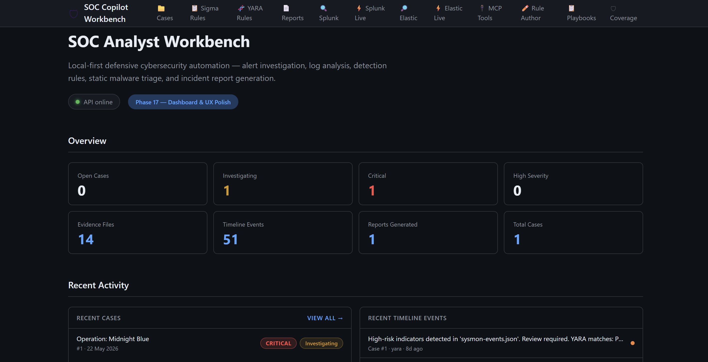

<div align="center">

# 🛡️ SOCMAT Copilot Workbench

**A local-first, open-source SOC analyst investigation platform.**

Parse logs · Run detections · Map techniques · Write reports · Query live SIEMs — all in one place, all on your machine.

[](https://python.org)
[](https://fastapi.tiangolo.com)
[](https://react.dev)
[](https://docker.com)
[](LICENSE)



</div>

---

## 🔍 What Is This?

Modern SOC analysts juggle a dozen tools simultaneously — log parsers, detection engines, MITRE mapping, and report writing — all in separate windows with no unified view.

**SOCMAT Copilot** brings the entire Tier 1–2 investigation workflow into one local, privacy-first workbench. No cloud upload. No telemetry. No SaaS subscription. Everything runs on your machine.

---

## ✨ Feature Overview

| Category | What You Get |
|----------|-------------|
| 📁 **Case Management** | Create cases, track severity/status, attach assets |
| 📤 **Evidence Upload** | Attach log files, exports, and artifacts (50 MB, path-traversal protected) |
| 🪟 **Windows / Sysmon** | Parse Event Logs and Sysmon telemetry; normalize into a timeline |
| 🌐 **Network Logs** | Analyze Suricata EVE JSON, Zeek conn/dns/http logs; detect C2 and tunneling |
| 📡 **PCAP Analysis** | Static packet capture analysis — top talkers, DNS, TLS/SNI, beaconing, DGA |
| 🔎 **Sigma Detection** | Run Sigma YAML rules; human-readable rule explanations |
| 🧬 **YARA Triage** | Scan uploaded artifacts statically — files are never executed |
| 🔗 **Live Splunk** | Query Splunk Enterprise/Cloud via REST; 7 pre-approved SPL templates |
| ⚡ **Live Elastic** | ES\|QL queries against Elasticsearch 8.11+; 7 hunt templates |
| 🧠 **AI Assistant** | Grounded case summarization and next-step recommendations (Groq/Anthropic/OpenAI/mock) |
| 🤖 **MCP Tool Server** | 22 MCP tools — expose case data to Claude Desktop or any MCP-aware AI agent |
| 🗺️ **Investigation Map** | Interactive entity graph with 14+ node types; filter, click detail, export JSON |
| ⏱️ **Timeline Replay** | Step through events with play/pause/speed controls; per-event MITRE context |
| 📋 **Playbooks** | 10 built-in investigation playbooks; step-by-step checklists with progress tracking |
| 🏷️ **IOC Basket** | Auto-extract IOCs (IPs, domains, hashes, users, paths, 16 types); tag, export CSV/JSON |
| 🎯 **Finding Disposition** | Mark findings true positive / false positive / escalated (8 values, confidence, reason) |
| 📊 **Coverage Analysis** | Sigma rule coverage vs. case data; telemetry gap catalogue with remediation guidance |
| 📄 **Report Generator** | Structured Markdown + styled PDF incident reports from all findings |
| ✅ **Report Readiness** | 22-check completeness score (0–100) before generating reports |

---

## 🚀 Quick Start

### Option 1 — One command (Windows, recommended)

```powershell
.\start.ps1
```

That's it. The script checks Docker, creates your `.env` if missing, builds and starts both containers, waits for the backend, and opens the browser automatically.

**Prerequisites:** [Docker Desktop](https://www.docker.com/products/docker-desktop/) must be running.

---

### Option 2 — Docker Compose manually

```bash
# 1. Copy environment template
cp services/api/.env.example services/api/.env

# 2. Start everything
docker compose up --build
```

| URL | What's there |
|-----|-------------|
| `http://localhost:5173` | App (React UI) |
| `http://localhost:8000` | Backend API |
| `http://localhost:8000/docs` | Interactive API docs (Swagger) |

---

### Option 3 — Local dev (no Docker)

```bash
# Backend
cd services/api
pip install -r requirements.txt
uvicorn main:app --reload

# Frontend (new terminal)
cd apps/web
npm install
npm run dev
```

---

## ⚙️ Configuration

All config lives in `services/api/.env` (gitignored — never committed). Copy the template and fill in what you need:

```bash
cp services/api/.env.example services/api/.env
```

```env
# AI provider — "mock" works out of the box, no key needed
AI_PROVIDER=groq          # mock | anthropic | openai | groq
GROQ_API_KEY=gsk_...

# Live Splunk (optional)
SPLUNK_URL=https://your-splunk:8089
SPLUNK_TOKEN=your-token

# Live Elastic (optional)
ELASTIC_URL=https://your-elastic:9200
ELASTIC_API_KEY=your-base64-key
```

> **Tip:** The app works fully in `AI_PROVIDER=mock` mode — no API keys needed at all.

---

## 🎬 Demo Scenario — Operation: Midnight Blue

A pre-built fictional SOC incident that exercises every module:

- Credential spray against `jsmith` (Windows Security EID 4625/4624)
- Encoded PowerShell execution (Sysmon EID 4688)
- C2 beacon to `192.168.1.200` (Suricata + Zeek)
- DNS tunneling indicators (Zeek DNS analysis)
- Sigma hits: brute force, encoded PowerShell, new service
- YARA triage: suspicious payload static analysis
- Full MITRE mapping: T1110, T1059.001, T1071, T1210
- Auto-generated Markdown + PDF incident report

**Seed it:**

```bash
# With backend running:
python scripts/seed_demo.py
```

---

## 🔄 Typical Investigation Workflow

```
1. Create a case           →  Cases tab → New Case
2. Upload evidence         →  Case detail → Evidence → Upload
3. Run log analysis        →  Run Windows / Suricata / Zeek / PCAP analysis
4. Run detections          →  Run Sigma rules · YARA triage
5. Correlate findings      →  Correlation tab
6. Map to MITRE ATT&CK     →  MITRE tab
7. Review dispositions     →  Mark findings true/false positive
8. Check readiness score   →  Report tab → Readiness
9. Generate report         →  Report tab → Generate (Markdown + PDF)
10. Get AI summary         →  AI Assistant → Summarize / Recommend
```

Everything is also available via REST API — see `http://localhost:8000/docs`.

---

## 🤖 AI & MCP Support

### AI Investigation Assistant

The assistant is **grounded** — it only references findings stored in the case. No hallucination. Providers:

| Provider | `AI_PROVIDER` | Key needed |
|----------|--------------|-----------|
| Mock (default) | `mock` | No |
| Groq (fast, free tier) | `groq` | `GROQ_API_KEY` |
| Anthropic Claude | `anthropic` | `ANTHROPIC_API_KEY` |
| OpenAI | `openai` | `OPENAI_API_KEY` |

### MCP Tool Server (22 tools)

Register SOCMAT's MCP server in Claude Desktop or any MCP-aware client to let an AI agent run full investigations autonomously:

```json
{
  "mcpServers": {
    "socmat": {
      "command": "python",
      "args": ["services/mcp-server/server.py"],
      "env": { "MCP_BACKEND_URL": "http://localhost:8000" }
    }
  }
}
```

**Tool categories:** case reads · log analysis · detection · live Splunk · live Elastic · reporting

---

## 🛡️ Supported Data Sources

| Source | Format | Module |
|--------|--------|--------|
| Windows Event Logs / Sysmon | JSON export | `integrations/windows_logs` |
| Suricata IDS/IPS | `eve.json` | `integrations/suricata` |
| Zeek Network | `conn.log`, `dns.log`, `http.log` | `integrations/zeek` |
| PCAP / PCAPNG | `.pcap`, `.pcapng`, `.cap` | `integrations/pcap` |
| Splunk | CSV / JSON export | `integrations/splunk` |
| Elasticsearch / Kibana | NDJSON export | `integrations/elastic` |

---

## 📁 Project Structure

```
socmat-copilot/
├── apps/web/              # React + Vite + TypeScript frontend
├── services/
│   ├── api/               # FastAPI backend (routers, models, schemas)
│   └── mcp-server/        # MCP tool server (22 tools, stdio transport)
├── integrations/          # Standalone parser modules (importable)
│   ├── windows_logs/      # Windows / Sysmon parser
│   ├── suricata/          # Suricata EVE JSON parser
│   ├── zeek/              # Zeek log parser + analyzer
│   ├── yara/              # YARA scanner + loader
│   ├── sigma/             # Sigma rule loader + matcher
│   ├── splunk/            # Splunk connector + export parser
│   ├── elastic/           # Elasticsearch connector + hunt templates
│   └── pcap/              # PCAP/PCAPNG static analysis
├── rules/
│   ├── sigma/             # Sigma YAML detection rules
│   └── yara/              # YARA static analysis rules
├── sample-data/           # Operation: Midnight Blue demo files
├── scripts/               # seed_demo.py, smoke tests, certify
├── docs/                  # Architecture, data model, per-module docs
├── start.ps1              # One-command Windows launcher
└── docker-compose.yml
```

---

## 🔒 Security Model

This tool performs **static analysis only**. Uploaded files are read — never executed.

| Control | Implementation |
|---------|---------------|
| File execution | Never — no subprocess/exec/eval on uploads |
| Path traversal | `_safe_filename()` + `Path.is_relative_to()` guard |
| Upload size | 50 MB hard cap (HTTP 413 before disk write) |
| CORS | Restricted to `localhost:5173` |
| Secrets | API keys from env vars only — `.env` is gitignored |
| Input validation | Pydantic v2 on all endpoints |

> ⚠️ Do not upload live malware outside an isolated lab. Do not expose port 8000 to a network. Do not connect production SIEM credentials in dev mode.

---

## 🧪 Testing

```bash
# Unit tests
pytest tests/ -v

# Backend smoke test (requires running backend)
python scripts/smoke_backend.py

# Advanced feature test (requires backend + demo data)
python scripts/smoke_advanced_features.py
```

---

## 🗺️ Roadmap

<details>
<summary>33 completed phases</summary>

- [x] Phase 1–3: Architecture, case management, evidence upload
- [x] Phase 4–9: Windows, Suricata, Sigma, YARA, Zeek log parsers
- [x] Phase 10–13: Correlation, MITRE mapping, report generator, AI assistant
- [x] Phase 14: MCP tool server
- [x] Phase 15–16: Splunk + Elastic export and query assistant
- [x] Phase 17: Dashboard and UX polish
- [x] Phase 18–20: Demo scenario, testing, GitHub-ready release
- [x] Phase 21: PDF report export
- [x] Phase 22–23: Live Splunk + Elastic connector
- [x] Phase 24: PCAP / network traffic analysis
- [x] Phase 25: Detection rule authoring assistant
- [x] Phase 26–27: Investigation playbooks + analyst notes
- [x] Phase 28: IOC extraction and IOC basket
- [x] Phase 29: Entity graph / investigation map
- [x] Phase 30: Attack timeline replay mode
- [x] Phase 31: Detection coverage and telemetry gap analysis
- [x] Phase 32: Finding disposition and false positive review
- [x] Phase 33: Report readiness score

</details>

---

## 🤝 Contributing

This is a **blue-team defensive tool**. Contributions that introduce offensive functionality, exploit code, or malware execution will not be accepted.

See [CONTRIBUTING.md](CONTRIBUTING.md) for guidelines.

---

## 📜 License

[MIT](LICENSE) — © 2025 SocMat Copilot

---

<div align="center">

**GitHub Topics:**
`cybersecurity` · `soc` · `blue-team` · `threat-hunting` · `incident-response` · `sigma` · `yara` · `suricata` · `zeek` · `splunk` · `elasticsearch` · `fastapi` · `react` · `mcp` · `ai-security`

</div>
